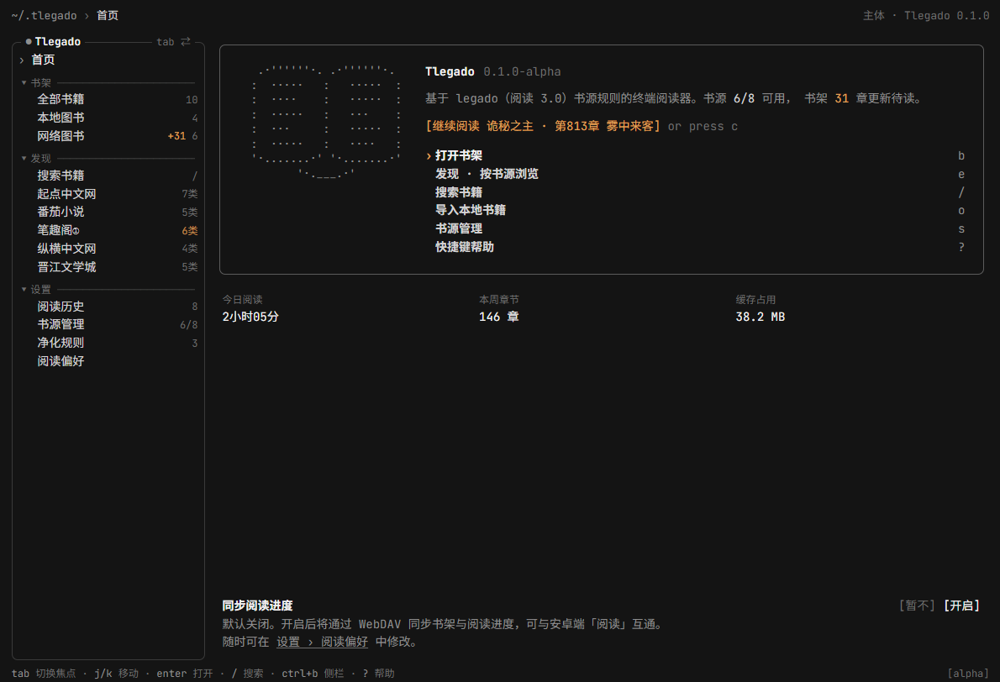

## TLegado
终端版阅读3.0，基于 rust 与 ratatui，提供优美的TUI，完善舒适的交互。


## TUI 前端演示

演示地址：https://wep-56.github.io/Tlegado/

此站点仅为react静态模拟，提供使用前预览，不代表真实TUI视觉、交互效果，真实效果以安装后为准。


React 原型源码位于 `TUI-example/Tlegado-TUI`，已同步最新原型压缩包中的页面、样式和首页书本动画。终端首页使用同一套书本概念的 Braille 动画，包含文字阅读进度、丝带和翻页循环。

## 键盘操作介绍

书架、发现、搜索结果中按 `Enter` 进入阅读，首页主体中按 `c` 继续阅读。

阅读时左栏替换为章节目录：高亮行表示选中章节，`●` 表示当前正文对应章节。

- `Tab`：目录与正文切换焦点；目录中 `j/k` 或上下键选择，`Enter` 打开。
- 正文 `j/k`：逐行滚动；`Space` / `PageDown` 下一页，`PageUp` 上一页。到章末继续向后翻页或滚动会进入下一章；在章首向前则回到上一章末页。全书首尾不会循环跳转。
- `[` / `]`：上一章 / 下一章；`g/G`：目录或正文首尾。
- `t`：定位并聚焦当前章节；`Ctrl+B`：显示或隐藏目录。
- 真实模式 `s`：打开候选书源，`j/k` 选择、`Enter` 换源、`Esc` 取消。新目录优先匹配原章节标题，否则按原章节序号定位并限制在目录范围内；不同源正文从章首开始。
- `q` / `Esc`：返回进入阅读前的页面，并恢复原先的侧栏显隐状态。
- `?`：阅读快捷键帮助。

## 本地开发

默认启动真实模式，首次运行没有内置书源。先准备 Legado JSON 书源文件：

```powershell
cargo run -- --import-source "C:\Books\书源.json"
```

也可以直接运行 `cargo run`，进入书源管理后按 `Tab` 将焦点移到主体，按 `i` 输入 JSON 文件路径。支持单个对象、数组及旧版书源迁移；同 URL 书源覆盖更新。每个文件先整体校验，再以事务导入，文件上限 16 MiB。

- `/` 输入关键词，`Enter` 提交多源搜索，再按 `Enter` 打开选中书籍。
- 搜索/分类结果按 `n` 追加后续页，`r` 只重试失败或取消的未完成页；每个书源独立推进页码。空页或全重复页停止该源续页，追加结果保留当前选中项。
- 同名同作者结果合并为一行并显示候选数；忽略空白、大小写及作者标签，作者缺失时不跨源合并。`s` 打开候选书源列表，同时按书名搜索更多来源；弹层也支持 `n/r`。
- 换源先加载目录与正文，再串行保存书架；加载、保存失败或提交前取消均保留原阅读状态。保存期间短暂锁定弹层操作，退出会排空已提交保存。候选来源、书架分组与映射后的进度持久化；书架文件使用同目录临时文件写完后替换。
- 侧栏“探索书源”为统一入口，按名称、分组或 URL 筛选后按 Enter 浏览该源分类；分类页 Backspace 返回列表。侧栏仅保留当前探索的一个书源，不随导入数量增长。
- 网络书打开后为试读，阅读中按 `a` 加入书架并保存当前位置；搜索/发现页也可按 `a` 加入。只有书架内图书自动保存进度（约每 2 秒，以及切章、返回、退出时）。移除后到达的旧进度不会重新创建书架记录。
- 书架主体按 `x`，再按 `y` 确认：网络书移出书架；本地书删除数据目录中的导入副本，原始 TXT/EPUB 文件保留。`n/Esc` 取消。
- 阅读正文和目录会缓存；已缓存章节可断网读取，重启后恢复章节和字符位置。
- 书源管理中 `/` 筛选名称/分组/URL，`f` 切换全部/启用/禁用/可探索，`PgUp/PgDn` 翻页，`g/G` 跳到首尾。
- `空格` 多选，`a` 全选当前筛选结果，`A` 清空多选；`Enter` 统一启停，`+/-` 明确启用/禁用，`e` 统一切换探索，`E` 关闭探索。未多选时只操作当前项。改变筛选会清空多选。
- `x/Delete` 删除当前项或多选项，弹框列出目标数量与名称，须按 `y` 确认；`n/Esc` 取消。批量操作通过 SQLite 事务保存；删除书源保留书架、进度与缓存，后续依赖该源的联网读取需重新导入书源。
- `i` 导入、`o` 导出全部书源到新文件、`v` 查看当前项 JSON，`?` 查看列表快捷键。导出不会覆盖已有文件。
- `Esc` 取消搜索/打开操作；阅读中返回上个页面。取消后丢弃旧结果并停止调度，已发出的请求正常结束。`Ctrl+C` 保存进度并退出。

数据默认保存在用户目录的 `.tlegado`，可用 `TLEGADO_DATA_DIR` 或 `--data-dir` 指定。命令行导入支持重复传入多个 `--import-source`：

```powershell
cargo run -- --data-dir "E:\Reader Data" --import-source "C:\Books\书源.json" --import-only
cargo run -- --data-dir "E:\Reader Data"
cargo run -- --demo
cargo test --workspace --locked --lib --bins --tests -j 4
```

`--demo` 保留原离线演示，不读写真实数据。正式构建使用纳入版本控制的 `crates/legado-core`，不依赖本机的 `legado-example/` 参考目录。

搜索/发现支持后续分页，每源每页最多 200 条，每次查询累计最多 2000 条候选（包含合并行的不同来源），并发上限 4。书源排序、批量校验/更新和自动重试仍待接入，鼠标交互适配继续延后。用户已实测书源基本兼容；自动验收使用本地 HTTP 测试书源，完整跨平台人工终端验收仍待完成。

## 本地书籍、分组与阅读设置

- 首页或书架主体按 `o` 输入 TXT/EPUB 路径，也可使用 `--import-book`（可重复指定）。TXT 最大 50 MiB、EPUB 最大 80 MiB。导入会在数据目录保存副本，之后可移动原文件；同文件名且内容相同的重复导入不会重置进度。修改内容后会作为另一本书导入。TXT 保留原文中的尖括号；EPUB 按目录显示纯文本正文，不显示插图。
- 书架主体按 `m` 管理分组：`a` 新建、`e` 重命名、`x` 删除、`J/K` 调整顺序；删除需 `y` 确认。非空分组须先迁出书籍。按 `M` 为所选书籍选择分组，`Enter` 确认；选择“未分组”可解除归组。`h/l` 切换书架分组，空分组也保留入口。
- 净化规则页 `a` 新建、`e` 编辑、空格/Enter 启停、`x` 确认删除、`J/K` 调整应用顺序、`p` 编辑试算原文。编辑框使用 `Tab/Shift+Tab` 切换、`Ctrl+U` 清空当前字段、`Ctrl+S` 保存、`Esc` 取消；最后一栏 Enter 也可保存。
- 规则支持字面替换、正则捕获组、前向断言、固定长度后顾和反向引用；可用 `$1` / `${name}` 替换捕获组，兼容 Java 水平空白 `\h`。可变长度后顾等 Java 语法仍不支持。范围为空时应用全部书籍，否则填写逗号分隔的完整书名、书籍 URL 或书源 URL。JSON 的 `scopeContent` / `scopeTitle` 分别控制正文与标题；旧规则默认仅正文，进度和换源匹配仍使用原始标题。
- 净化规则页按 `i` 导入 JSON 文件或 HTTP(S) URL，支持 BOM、对象和数组。按名称、分组及范围合并，保留已有本地 ID 与顺序；新规则按顺序追加。整批结构校验后写入，最多 500 条、输入上限 4 MiB。不支持的规则保留并停用，规则页显示原因。
- `@js:` 替换以匹配文本作为 `result`，在受限 QuickJS 中执行，不提供 Android/Java/文件/网络接口。每条脚本限制 8 MiB 内存、30 ms；正则有回溯上限，整轮净化还有时间与输出大小限制。失败的单条规则不修改正文并显示提示。试算不受启停和范围限制。
- 阅读偏好页按 `i` 导入 Legado `readConfig.json`（单对象或仅含一个配置的数组）。应用日间文字/背景颜色、粗体、缩进、行/段间距；颜色支持 RGB/ARGB，不映射透明度。间距 0 不留空行，正值按约 16 像素一行近似为 1–3 行。字体、字号、像素边距、图片背景、夜间/墨水屏、页眉页脚、动画等字段仅保留。手动修改主题/行距/缩进覆盖对应导入字段，`R` 清除导入排版并恢复默认。配置及原始字段保存于 SQLite 文档 `legado_read_config.json`。
- CLI 支持 `--import-rules 路径或URL`、`--import-layout 路径或URL`，可与 `--import-only` 合用。示例净化包 `3f067eb2.json` 的 20 条均可导入，当前 17 条因不兼容语法停用；导入成功不代表插件与 Android Legado 效果完全一致。
- 阅读偏好的主题、宽度、行距、缩进、翻页、进度显示及净化开关自动保存，`R` 恢复默认；收到后台保存成功回执后更新界面。净化只影响展示，原文与缓存保持原样，进度映射回原文 Unicode 字符位置；关闭净化或改变行宽后仍能恢复附近位置。
- 分组、规则和偏好保存在 `reader.db` 的 `json_documents` 中，分别为 `book_groups.json`、`replace_rules.json`、`tui_preferences.json`；书籍归组及进度保存在书架文件。退出前会排空已提交写入，未恢复的偏好保存失败会返回退出错误。

```powershell
cargo run -- --import-book "C:\Books\小说.txt" --import-book "C:\Books\小说.epub"
cargo run -- --data-dir "E:\Reader Data" --import-book "C:\Books\小说.epub" --import-only
```

搜索时 JavaScript 规则的同步 HTTP 请求会在普通线程执行，不在 Tokio 异步上下文中构造阻塞客户端。后台任务 panic 写入数据目录的 `panic.log`，由界面显示任务错误；只有主界面线程 panic 才恢复终端并输出异常，避免后台失败退出全屏模式。`cargo run` 启动前的增量缓存硬链接警告属于编译器提示，与运行时 TUI 输出无关。

## 致谢
本项目的rust legado3.0实现参考了：[Reader](https://github.com/hadc188/Reader)

## Licenses
MIT
